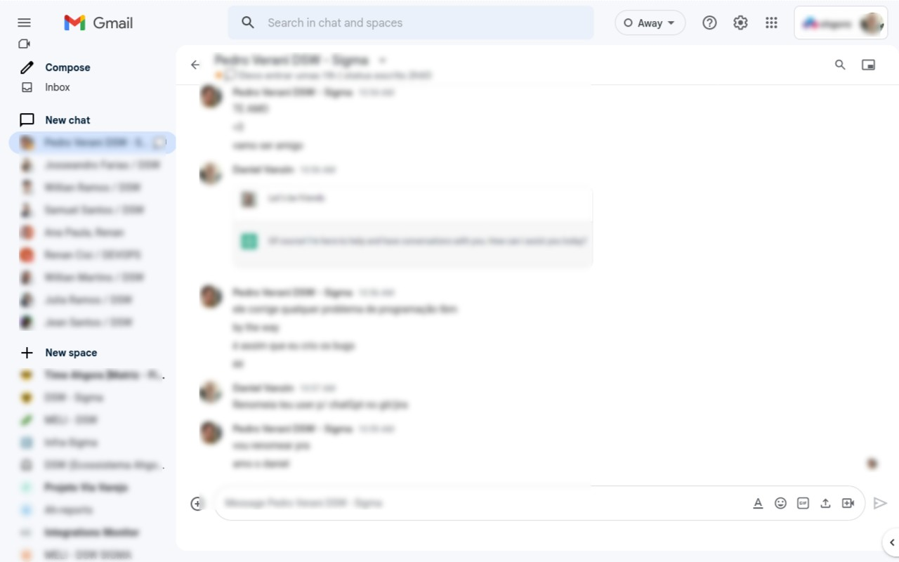

# Gmail Persistent Sidebar
Keeps email, chat and spaces sidebar always visible.

### After


## Install
[Userscript][1] - [Firefox][2] - [Chrome][3].

## Why
<!-- Focus on explaining what the item does and why users should install it -->
I use email, chat and space as if they were a single service. To see if I have a new message:
- **before**: hover each panel (pull model)
- **after**: no hovering needed (push model)

## Bonus: highlight tab when it has new messages
Gmail has a VERY discrete icon when you have new messages. It also doesn't discriminate the type of message. To fix this, you can add these entries to your `$HOME/.mozilla/firefox/PROFILE.default/chrome/userChrome.css` (create if it doesn't exist)

```css
tab[label$='- Chat'] { background: #a2f2b8 !important }  /* if the tab title ENDS WITH '- Chat', make the tab green */
tab[label^='Inbox ('] { background: #a2f2b8 !important } /* if the tab title STARTS WITH 'Inbox (', make the tab green */
```

### Limitations
I couldn't get resizing to stick, I think it's because of CSS grid layout. If you want to change row size, look for this code `grid-template-rows: 75px 1fr 1fr;` and change to your desire. Ex: `grid-template-rows: 150px 250px 1fr;`

[Contributing](https://github.com/icetbr/my-projects/blob/main/CONTRIBUTING.md)\
[License (MIT)](https://choosealicense.com/licenses/mit/)

[1]: https://openuserjs.org/scripts/icetbr/Gmail_Persistent_Sidebar
[2]: https://addons.mozilla.org/en-US/firefox/addon/gmail-persistent-sidebar/
[3]: https://chrome.google.com/webstore/detail/gmail-persistent-sidebar/jdlfdphbmmhnomfohebjninafjnpbmmm
